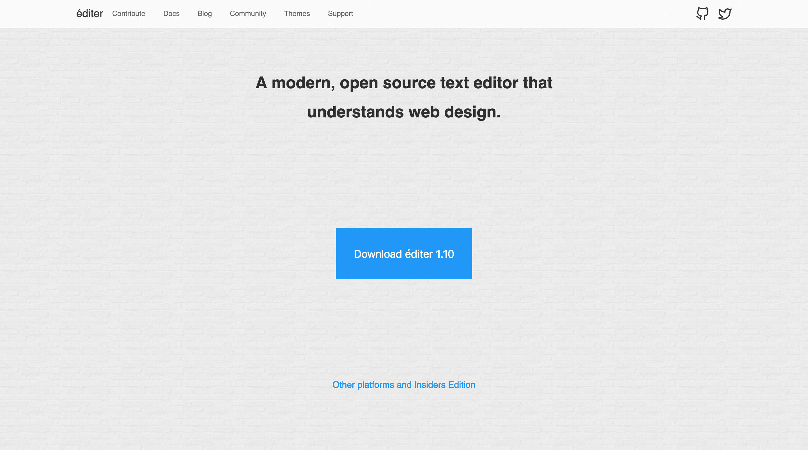

# Code Editor Theme

Template for code editor or similar software.

## Assets

- [Brickwall background](https://www.toptal.com/designers/subtlepatterns/brick-wall)
- [Roboto font](https://fonts.google.com/specimen/Roboto)
- [Icons](https://feathericons.com)

## License

This project is licensed under the MIT License - see the [LICENSE](LICENSE) file for details.
